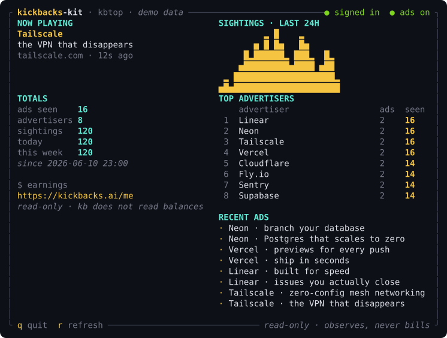

<div align="center">

# kickbacks-kit

**Phase 0 desktop command center for Kickback.ai developer earning integrity.**

Verified developer activity should start with official earning adapters, flow
through backend trust ledgers, and end in advertiser assurance that is visible
and auditable. This branch packages the local side of that story: a dark desktop
command center, surface-neutral opt-in monetization boundaries, official adapter
proof vocabulary, a Trust Engine report, advertiser assurance language, and the
older local archive/TUI companion moved underneath the product pitch.

[](LICENSE)
[](https://www.rust-lang.org/)
[](#safety-boundary)



</div>

---

Kickback.ai has the important first product promise: developer attention inside
real workflows can become valuable only when it is explicit, trusted, and
auditable. Phase 0 is about making that promise feel trustworthy before it feels
large. Developers need to see whether their local surfaces are installed and
syncing. Advertisers need proof that bot pressure, probe traffic, caps, refunds,
holds, reversals, and payout release are separated in ledgers instead of blurred
into one impression count.

`kickbacks-kit` is the local command center for that MVP:

- verified developer activity starts with official Kickback.ai earning adapters,
  not with dashboard, repair, skill, or diagnostic code;
- `kb app` opens a dark desktop console for install state, ledger freshness,
  Trust Engine state, Stripe readiness boundaries, local archive, and a
  founder-facing developer note;
- `kb trust` shows the two-way Trust Engine: user risk, surface risk, earning
  eligibility states, caps, payout holds, refund exposure, finality gates, and
  advertiser proof;
- `kickbacks install --all --yes` and `kickbacks repair --all --yes` wire the
  local control surfaces for VS Code, Claude Code, Codex, Hermes Agent/TUI, and
  Claude/Codex/Hermes skills;
- the original `kb top`, `kb watch`, `kb snapshot`, and archive commands still
  keep a local history of the ads the extension shows.

The shipped local MVP does not self-settle money. The desktop app observes,
diagnoses, installs marker-owned files, and labels backend-owned states.
Official adapters create earning candidates; backend ledgers decide billable
attention, settlement, refund exposure, payout readiness, and finality; Stripe
Connect is only a payout rail after those gates clear.

Desktop, CLI/TUI, Telegram, Discord, chat, and agent workflow surfaces can
become real developer-attention monetization surfaces when Kickback.ai ships
registered official opt-in earning adapters for them. This repository treats
those as product contracts, not as shipped local backend functionality. The
required adapter contract stays explicit, user-controlled, authenticated,
capped, visibility-proven, backend-attested, reconciled, and subject to refund
windows and settlement gates.

Every agent interaction with developer attention is advertising inventory only
under that same official-adapter contract. A waiting state, review prompt,
support answer, CLI/TUI moment, desktop panel, Telegram message, or Discord bot
interaction is earning inventory only when it is a registered official opt-in
adapter with proof and backend settlement. Plain diagnostics, generated notes,
repair probes, and unauthenticated chat output remain non-earning.

`kickbacks-kit` is a local Phase 0 package for Kickback.ai-facing workflows. It
does not operate the Kickback.ai backend, the advertiser billing ledgers, or
ShiftKeys, Inc. services.

## Shipped locally

These features are implemented in this Rust repository:

| Surface | Local behavior |
| :------ | :------------- |
| Desktop command center | `kb app` serves a dark local console and JSON API at `http://127.0.0.1:38241`. |
| Trust Engine | `kb trust` classifies local evidence, names backend-required gates, and exposes advertiser assurance buckets. |
| Ledger freshness | `kb sync status` compares local metric sends, auth failures, and a user-provided account-ledger watermark. |
| Installer/repair | `kickbacks install`, `kickbacks repair`, and `kickbacks restore` manage marker-owned integrations without overwriting foreign files. |
| Agent wrappers | `kickbacks claude`, `kickbacks codex`, and `kickbacks hermes` launch the underlying CLIs through Kickback.ai wrappers. |
| Skills | Claude, Codex, and Hermes skills explain install state, ledger freshness, Trust Engine output, and non-earning probe rules. |
| Hermes | Hermes gets a plugin, skill, CLI command group, and TUI slash command manifests for status, repair, dashboard, sync, trust, and doctor flows. |
| Local archive/TUI | `kb setup`, `kb watch`, `kb top`, `kb snapshot`, `kb archive`, and `kb export` store and display local ad observations. |

Local evidence is intentionally limited. Cluster detection across IP, ASN,
device, account age, Stripe/KYC state, payout identity, advertiser refund
exposure, and payout finality requires backend data. The app labels those as
backend-owned instead of pretending the desktop can settle them.

External earning surfaces are outside this repository's verification scope.
Phase 0 defines the contract those surfaces must satisfy before Kickback.ai can
treat them as earning inventory: registered official adapters, explicit user
controls, proof, backend acceptance, refund windows, and settlement gates.

## Local Repo vs Live System

| Surface | Phase 0 status | Earning boundary |
| :------ | :------------- | :--------------- |
| VS Code / developer-tool extension activity | Active upstream surface observed by the local archive. | Earning belongs to official Kickback.ai adapters and backend ledgers, not the archive. |
| Desktop command center | Shipped locally through `kb app`. | Desktop attention can become an earning candidate only through registered adapters; this dashboard remains a control surface unless the official adapter path is active. |
| CLI/TUI archive | Shipped locally through `kb top`, `kb watch`, `kb snapshot`, and archive/export commands. | Local observation only; archive rows never self-promote into payable attention. |
| Claude, Codex, and Hermes skills/wrappers | Shipped local install, repair, diagnostic, and command surfaces. | Agent attention can monetize only through registered adapters; local skills and wrappers stay non-earning unless they invoke that adapter path. |
| Telegram and Discord | Future or external product surfaces, not shipped by this repo. | Monetized only through signed official opt-in adapters, caps, refund windows, advertiser reporting, and backend settlement. |
| Reward Exchange | Backend roadmap. | Optional credits, multipliers, vendor linking, holds, and reversals stay backend-owned. |

## Backend And System Contracts

These are product contracts for any Kickback.ai backend integration, not shipped
local control-surface claims:

- official earning adapters sign candidate events with surface ID, adapter
  ID/version, user/session ID, campaign/creative ID, render timestamp,
  wait-state proof, threshold timestamp, cap context, adapter signature/key ID,
  session binding, compatibility manifest, and server-issued single-use nonce;
- official opt-in earning adapters are first-class monetized surfaces across
  desktop, CLI/TUI, Telegram, Discord, chat, and agent workflow tools when they
  have user controls, visibility proof, backend attestation and reconciliation,
  caps, refund windows, fraud review, and settlement gates;
- loopback-readable tokens, leaked local API tokens, realistic saturation
  traffic, and brittle third-party anchors are hard-stop threats; they require
  nonce replay ledgers, aggregate account-level checks, duty-cycle heuristics,
  strict concurrency limits, human-in-the-loop ML reason codes, signed
  compatibility manifests, and fail-closed adapter preflights before billing;
- the backend Trust Engine owns acceptance, rejection, cap arithmetic, invalid
  traffic filtering, advertiser refunds or credits, payout holds, and payout
  release;
- ML is a fraud-risk signal layer that emits reason-code candidates, while
  deterministic policy, manual review, and ledgers decide settlement;
- Stripe Connect stays server-side: local controls can show backend-provided
  requirements and payout readiness, but never holds Stripe secrets or creates
  money movement;
- Stripe Connect policy is part of the trust boundary, not a later payment
  detail: account type and controller responsibilities affect fraud, abuse,
  negative-balance, and identity-verification liability; KYC requirements can
  pause charges or payouts; marketplace-style account setups can make the
  platform responsible for negative balances and credit or fraud risk; and
  product language must avoid positioning Kickback.ai as resale of traffic or
  easy-money rewards;
- international payout readiness is a backend product boundary, including
  connected-account country support, requested capabilities, account-link
  refresh/return handling, onboarding completion, verification requirements,
  and tax/reporting state;
- Telegram, Discord, and other external surfaces use the same
  official-adapter contract; earning must not be created by hidden bot flows,
  skills, dashboards, repair probes, or unauthenticated chat output.

### IDE-local trust boundary

IDE integrations are high-risk because the developer machine often contains
source code, production credentials, API keys, SSH agents, signing material, and
private customer or advertiser context. Kickback.ai adapters must therefore be
API-native and fail closed:

- local artifacts, logs, workspace settings, extension state, and loopback
  tokens are diagnostic inputs only;
- no local IDE file, extension global state, loopback token, or marketplace
  directory name can prove human attention or payout readiness;
- official adapters should use supported IDE APIs, scoped short-lived secrets,
  signed adapter releases, signed compatibility manifests, and server-issued
  single-use nonces;
- adapter updates and third-party bundle anchors must fail to probe-only mode
  when signatures, publisher identity, compatibility manifests, or expected
  anchors do not verify;
- Kickback.ai should not patch third-party IDE bundles, webviews, scripts, or
  upstream-owned files to inject monetization behavior.

## Stripe Connect And Policy Constraints

Official Stripe references checked at `2026-06-12 19:23`:
[Connect risk and liability](https://docs.stripe.com/connect/risk-management),
[identity verification](https://docs.stripe.com/connect/identity-verification),
[connected account types](https://docs.stripe.com/connect/accounts),
[marketplace account creation](https://docs.stripe.com/connect/marketplace/tasks/create),
[API verification handling](https://docs.stripe.com/connect/handling-api-verification),
and [prohibited and restricted businesses](https://stripe.com/legal/restricted-businesses).

These references translate into Kickback.ai product rules:

- choose and record the Connect liability model before payout release; account
  type and controller responsibilities determine who owns fraud, abuse,
  negative-balance, and identity-verification risk;
- treat Stripe KYC and requirement status as dynamic backend state. The backend
  should monitor account and person updates, surface currently due and
  eventually due requirements, and expect charges or payouts to pause until
  required information is resolved;
- if Kickback.ai uses marketplace-style connected accounts or indirect charges,
  the backend must model platform liability for negative balances, reserves,
  refunds, disputes, and fraud review before releasing developer payouts;
- local software may display backend-provided Stripe onboarding, requirements,
  and payout readiness, but must not create account links, charges, transfers,
  payouts, refunds, credits, or connected-account mutations;
- Stripe secret keys, account tokens, payout identifiers, tax data, and
  connected-account credentials must stay server-side and out of local logs,
  docs, prompts, screenshots, fixtures, and generated notes;
- copy and advertiser reports must describe verified developer attention,
  filtered final reach, and backend-ledgered settlement. They must not imply
  resale of online traffic or engagement, guaranteed rewards, unrealistic
  incentives, or fast/easy money.

## Reward Exchange

The current payout story should remain cash-first: accepted earnings release
through backend trust gates and Stripe Connect readiness. The Reward Exchange is
a backend roadmap layer that can add optional sponsor-funded credits without
weakening the trust boundary.

Active in Phase 0: Reward Exchange appears as roadmap vocabulary and future
display space only. Future backend work can add sponsor-funded credits,
multipliers, linked vendor accounts, holds, reversals, and advertiser-visible
reporting after the same acceptance and refund gates as cash payouts.

Reward Exchange concepts:

- cash remains the default developer reward;
- sponsor-funded credits are optional and should be clearly labeled as credits,
  not cash;
- blended rewards can combine cash plus sponsor credits when the developer opts
  in;
- exchange multipliers can make some sponsor credits worth more inside a vendor
  ecosystem, but the multiplier belongs in a backend ledger;
- linked vendor accounts should be explicit, revocable, and separate from the
  local desktop archive;
- holds apply to both cash and credits until trust, refund, KYC, and reversal
  windows clear;
- reversals must claw back or adjust cash, credits, and multiplier benefits when
  events are rejected, refunded, disputed, or later classified as fraudulent.

The local console can display backend-provided Reward Exchange status later. It
should not create credits, choose multipliers, link vendor accounts, release
holds, or reverse balances locally.

## Safety boundary

The shipped Phase 0 control surfaces observe and configure. Dashboard, doctor,
installer, repair, skills, Hermes plugin, generated notes, local archive, CLI/TUI
screens, and tests must not:

- fabricate impressions, views, clicks, credits, balances, payouts, or charges;
- call Kickback.ai billing, metrics, or settlement routes from dashboard, doctor,
  installer, repair, skills, Hermes plugin, Telegram, Discord, or tests;
- keep a session visible to inflate view time;
- turn a local archive sighting into a payable event;
- hold Stripe secret keys, create charges, release payouts, or reverse payouts;
- overwrite user-owned skill, command, or plugin files that lack the
  `generated by kickbacks-kit` marker.

Allowed earning path:

- an official opt-in adapter, whether desktop, CLI/TUI, Telegram, Discord,
  chat, or an agent workflow surface, may create candidate attention events only
  after explicit consent, authentication, visibility proof, caps, and backend
  attestation;
- a candidate is not billable until backend ledgers accept it;
- a candidate is not payable until refund, review, reconciliation, KYC, and
  settlement gates clear.

The honest lever for more and better ads is still real developer work with the
official Kickback.ai adapter running. This project makes that work observable and
auditable; it does not manufacture activity.

## Install

From this Phase 0 branch:

```bash
git clone https://github.com/andrexibiza/kickbacks.ai.git
cd kickbacks.ai
git checkout axl/phase0-mvp-fork-main
cargo build --release
```

The build produces both binaries:

```bash
target/release/kb --help
target/release/kickbacks --help
```

From the original upstream package:

```bash
cargo install --git https://github.com/OthmanAdi/kickbacks-kit
```

## Quickstart

```bash
kb setup                     # create the local archive and capture once
kb status                    # are ads flowing right now, and if not, why
kb doctor                    # verify local data sources and archive wiring
kb sync status               # ledger freshness monitor
kb trust                     # user, surface, hold, cap, and advertiser proof report
kb app                       # dark local desktop console and API
kb top                       # live archive/TUI dashboard
kb watch                     # headless local capture loop
```

For the founder-facing product install:

```bash
kickbacks install --all --yes
kickbacks repair --all --yes
kickbacks restore
kickbacks claude
kickbacks codex
kickbacks hermes
kickbacks developer-note
```

Installer, repair, doctor, skills, dashboard, Trust Engine, Hermes, Telegram,
and Discord flows remain non-earning probe mode unless Kickback.ai ships a
distinct official adapter and backend ledger explicitly promotes a candidate
event.

## Desktop console

`kb app` starts the local dark-mode desktop console at
`http://127.0.0.1:38241`. It is designed as a working product surface, not a
marketing page:

- ledger freshness monitor for local metric sends versus the last known account
  ledger, without implying Stripe failure from a stale visible watermark alone;
- Trust Engine for user risk, surface risk, suspicious queues, payout holds, cap
  reasons, earning eligibility states, and advertiser proof;
- install status for VS Code, Claude Code CLI, Codex CLI, Hermes Agent/TUI, and
  skill packs;
- Hermes-specific status for the plugin, skill, CLI command group, and TUI
  slash commands;
- Stripe Connect readiness as a backend-owned contract;
- international connected-account onboarding status shown only from
  backend-provided Stripe readiness, not inferred from local logs;
- local archive, advertiser pulse, recent ledger, and founder-facing developer
  note.

The advertiser proof layer separates gross adapter events, held events,
rejected or fraudulent events, refunded events, final billable reach, and
payouts released after the trust window. Those numbers should come from explicit
backend ledgers: event classification, adapter attestation, fraud clusters,
advertiser refunds, and payout holds.

See [TRUST_ENGINE.md](TRUST_ENGINE.md) for the trust-boundary state machine,
settlement gates, advertiser assurance report, Reward Exchange boundary, and
Stripe payout boundary.

## Agent and skill surfaces

Claude Code:

```bash
kb install-claude --yes
kickbacks install --claude-cli --skills --yes
```

This installs `/kbtop` and `/kbstatus`, wraps the Claude Code status line with
`kb statusline`, and adds marker-owned Kickback.ai slash commands for dashboard,
status, repair, trust, and doctor flows.

Codex:

```bash
kickbacks install --codex-cli --skills --yes
kickbacks codex
```

Codex gets a marker-owned skill and wrapper diagnostics. Earning events remain
owned by official Kickback.ai adapters, not by Codex skill output.

Hermes:

```bash
kickbacks install --hermes --skills --yes
kickbacks hermes
```

Hermes gets a marker-owned skill, plugin, CLI command group, and TUI slash
commands:

```text
/kickbacks
/kickbacks-status
/kickbacks-repair
/kickbacks-dashboard
/kickbacks-sync
/kickbacks-trust
/kickbacks-doctor
```

Hermes should inspect, explain, repair marker-owned files, open the dashboard,
and hand implementation work to Codex. Hermes should not create earning events
or write settlement logic.

Telegram and Discord:

This repository does not contain a Telegram or Discord settlement backend. Those
surfaces can become earning candidates only when they run through registered
official adapters. They use the same attestation, cap, hold, refund, reversal,
and advertiser assurance model as the developer-tool surfaces.

## Commands

| Command | What it does |
| :------ | :----------- |
| `kb app [--port N] [--no-open]` | Local dark desktop trust console and JSON API. |
| `kb api ENDPOINT` | Print one local app API payload, such as `health`, `trust`, `install/status`, or `skills`. |
| `kb trust [--json]` | Two-way Trust Engine: eligibility states, caps, holds, advertiser proof, and bot-risk contract. |
| `kb sync status [--json]` | Ledger freshness monitor for local metric sends versus account ledger watermark. |
| `kb sync mark --at TIME` | Record the last known account-ledger sync time. Accepts epoch millis, RFC3339, or `YYYY-MM-DD HH:mm`. |
| `kb sync clear` | Clear the account-ledger sync watermark. |
| `kb auth status` | Show local auth-file presence without printing secrets. |
| `kb auth sign-in` | Point the user to the official Kickback.ai sign-in flow. |
| `kb auth sign-out` | Explain safe sign-out boundaries. |
| `kb install --all --yes` / `kb repair --all --yes` | Plug-and-play installer/repair for supported surfaces and skills. |
| `kb restore` | Remove marker-owned skills, plugin files, and slash commands. |
| `kb claude` / `kb codex` / `kb hermes` | Launch agent CLIs through Kickback.ai wrappers. Hermes launches with its TUI default. |
| `kb developer-note [--json]` | Print the founder-friendly contribution note. |
| `kb top [--theme T] [--chart-style C]` | Live TUI dashboard. Captures on every tick. Press `t` for a theme, `c` for a chart style. |
| `kb snapshot [--width N] [--plain] [--theme T] [--chart-style C]` | One-shot dashboard render to stdout. Same view as `kb top`. |
| `kb statusline [--width N] [--plain]` | One status-bar line: the current ad plus local kb stats. |
| `kb status` | Whether ads are flowing now, and why not: killswitch, idle, signed out, or local state. |
| `kb watch [--interval N] [--once]` | Headless capture loop. Default poll is 3 seconds. |
| `kb archive stats` | Summary: ads seen, advertisers, sightings, today, this week. |
| `kb archive list [--limit N]` | Captured ads, most recent first. |
| `kb archive top [--limit N]` | Advertiser leaderboard by sightings. |
| `kb export [--format jsonl\|csv] [--out FILE]` | Dump the local corpus. |
| `kb setup` | First run: create the archive and capture once. |
| `kb doctor` | Check local data sources and the archive. |
| `kb install-claude` / `kb uninstall-claude` | Add or remove legacy `/kbtop` and `/kbstatus` commands and the status line. |

The `kickbacks` binary is an alias for the same CLI as `kb`.

## Local archive and TUI companion

The original `kickbacks-kit` flow is still useful. The Kickback.ai extension
writes a handful of local files. This tool reads them and stores what it sees in
SQLite:

| Source | Provides | Used for |
| :----- | :------- | :------- |
| `~/.vibe-ads/cli-ad.json` | The current ad: text, click URL, icon, rotation timestamp. | Capturing each ad into the archive. |
| `~/.vibe-ads/debug.log` | Lifecycle events: signed in, ads on, killswitch, Claude Code version, metric-send hints. | Status, sync health, and session state. |

Each ad is keyed by a hash of its click URL and text, so repeated rotations of
the same creative collapse to one row with a `times_seen` count. A rotation is
recorded once by timestamp, which makes capture idempotent.

The archive is a single SQLite file under your platform data directory:

- Windows: `%APPDATA%\kickbacks-kit\kickbacks.db`
- macOS: `~/Library/Application Support/kickbacks-kit/kickbacks.db`
- Linux: `~/.local/share/kickbacks-kit/kickbacks.db`

It never leaves your machine. `kb export` hands it back to you as JSONL or CSV.
Override the location with `KICKBACKS_KIT_DB`, and point the reader at a
different artifact directory with `KICKBACKS_VIBE_DIR`.

## Themes

The terminal dashboard reads on dark or light terminals. Pick a theme with
`--theme` on `kb top` or `kb snapshot`, or press `t` inside `kb top` for a live
picker. The choice is remembered.

| Theme | What you get |
| :---- | :----------- |
| `auto` | Detect a light or dark terminal and match it. Falls back to dark when the terminal does not report its background. |
| `dark` | A dark canvas, matching the screenshot. |
| `light` | A light canvas tuned for bright terminals. |
| `terminal` | No painted canvas: use your terminal's own colors and background. |

The sightings chart has two styles. `heat` is a calendar strip, one cell per
hour colored by activity. `bars` draws block bars on a baseline floor. Press `c`
in `kb top` to switch, or pass `--chart-style heat|bars`.

## Status and killswitch

Kickback.ai can pause ads server-side with a killswitch. When that happens, the
extension keeps running but no ads show, which can look like a local breakage.
`kb status` reads the extension's own last reported state and says so plainly:

```text
ads  PAUSED (Kickback.ai killswitch active)
```

`kb top` shows the same state as an "ADS PAUSED" banner. The state comes from
the extension log, so reload the VS Code window if you want it refreshed.

Kickback.ai does not publish a status page. The maintainer posts outages and
"we're back" notes on X: [@andrewmccalip](https://x.com/andrewmccalip). That,
plus `kb status`, is the most honest local read available.

## FAQ

**Does this earn me more money or boost Kickback.ai earnings?**
Not by itself. The shipped local control surfaces do not post impressions,
views, clicks, credits, or payouts. Official opt-in adapters across desktop,
CLI/TUI, Telegram, Discord, chat, and workflow surfaces are earning paths only
as authenticated, consented, visibility-proven adapters that the backend accepts
before anything becomes billable or payable.

**Where do I see actual cash earnings?**
On your Kickback.ai portfolio at [kickbacks.ai/me](https://kickbacks.ai/me). The
desktop console can show local activity and backend-provided readiness later,
but it does not invent balances.

**Do I need to be signed in to Kickback.ai?**
The archive can read local files whether you are signed in or not. Sign-in only
matters for official earning surfaces and backend payout state.

**Does it work with Codex and Hermes as well as Claude Code?**
The archive captures any ad written to the shared local file. This branch also
adds Codex and Hermes install/skill/control surfaces. Codex and Hermes wrappers
are diagnostic/control-plane surfaces unless an official Kickback.ai adapter says
otherwise.

**Does it support Telegram or Discord?**
Not inside this local repo. Telegram and Discord can become earning surfaces
only when they run through registered official opt-in adapters. Any earning path
there stays signed, capped, proof-backed, and backend settled.

**What happens with sponsor credits or Reward Exchange multipliers?**
Those are backend roadmap features. Cash, sponsor-funded credits, blended
rewards, multipliers, linked vendor accounts, holds, and reversals all need
backend ledgers and advertiser-visible audit trails before the desktop displays
them as settled value.

## Roadmap

This roadmap separates the shipped Phase 0 desktop control plane from backend
product work. Phase names below are planning labels, not claims that this local
repository has shipped backend settlement features.

| Phase | Scope |
| :---- | :---- |
| 0 | Local desktop control plane, installer/repair, Hermes/Claude/Codex skills, Trust Engine report, sync freshness, developer note, and local archive/TUI companion. |
| 1 | Official adapter receipts for every earning surface, with signed candidate events, server-issued single-use nonces, session binding, and nonce replay rejection. |
| 2 | Append-only event classification ledgers for `probe`, `observed_local`, `candidate_adapter_attested`, `held_for_review`, `eligible_but_capped`, `backend_accepted`, `accepted_billable_after_refund_window`, `paid`, `refunded`, `rejected`, and `fraudulent` states. |
| 3 | Advertiser assurance reports that separate gross events, held events, rejected or fraudulent events, refunds, final billable reach, and payout-released counts. |
| 4 | Stripe Connect readiness and payout holds as backend-owned state displayed locally only when the backend provides it. |
| 5 | Trust Engine operations: deterministic policy, manual review queues, fraud-cluster evidence, aggregate account checks, duty-cycle heuristics, strict concurrency limits, cap arithmetic, refund windows, and reversal workflows. |
| 6 | ML fraud signals trained from known bot/farm labels, saturation-script patterns, nonce-replay attempts, and reviewed clean users, with policy and manual review retaining settlement authority. |
| 7 | Reward Exchange backend ledgers for cash, optional sponsor-funded credits, blended rewards, multipliers, linked vendor accounts, holds, and reversals. |
| 8 | Messaging-surface hardening for Telegram and Discord as official adapters, with the same attestation, cap, hold, refund, reversal, and advertiser assurance contract. |
| 9 | Backend-provided account, reward, hold, reversal, and advertiser-proof snapshots surfaced in the desktop without local balance invention. |
| 10 | Governance, audit exports, incident response, and responsible disclosure loops for advertiser and developer trust. |

Near-term local work stays focused on the desktop console, install state, Trust
Engine evidence, sync freshness, Hermes status, screenshots, and keeping `kb top`
as the compact archive view below the desktop product.

Backend/product next steps:

- official adapter receipts for every earning surface;
- append-only event classification, adapter attestation, nonce replay,
  adapter compatibility, refund, reversal, and payout-hold ledgers;
- maintain official opt-in adapters across desktop, CLI/TUI, Telegram, Discord,
  chat, and agent workflow surfaces with explicit consent, visibility proof,
  backend attestation, caps, refund windows, user controls, and settlement
  gates;
- Reward Exchange for cash, optional sponsor-funded credits, blended rewards,
  exchange multipliers, linked vendor accounts, holds, and reversals;
- advertiser assurance reports showing gross, held, rejected, fraudulent,
  refunded, final billable, and payout-released counts separately;
- loopback-token replay and realistic saturation attack immunity through
  server-issued nonces, aggregate account-level checks, duty-cycle heuristics,
  strict concurrency limits, signed compatibility manifests, and fail-closed
  adapter preflights;
- Telegram and Discord official adapters remain valid earning surfaces when
  they meet the same trust contract;
- ML fraud signals trained from known bot/farm labels and reviewed clean users,
  with policy and manual review retaining settlement authority.

Reading backend earnings directly in the local app is intentionally not part of
this repository. Account balances, credits, multipliers, holds, reversals,
refunds, and payouts belong to the Kickback.ai backend.

## Testing

```bash
cargo fmt --all -- --check
cargo test
cargo clippy --all-targets -- -D warnings
cargo build --release
```

Coverage should stay focused on the product boundary:

- Hermes plugin, skill, CLI group, and TUI command manifests are marker-owned
  and restorable;
- Claude/Codex/Hermes skills preserve non-earning probe mode;
- Trust Engine states keep local observation separate from backend acceptance;
- Reward Exchange, Telegram, and Discord docs do not imply shipped local
  settlement or earning adapters;
- dashboard, doctor, repair, skills, generated notes, and tests stay
  non-earning; any earning path must be a distinct official adapter accepted by
  backend ledgers.

## Contributing

Issues and pull requests are welcome. Contributors are credited in the
CHANGELOG and `CONTRIBUTORS.md`, not in commit trailers. See
[CONTRIBUTING.md](CONTRIBUTING.md).

## License

MIT. See [LICENSE](LICENSE).

Built by [Ahmad-Othman Adi](https://github.com/OthmanAdi) (CodingWithAdi).
